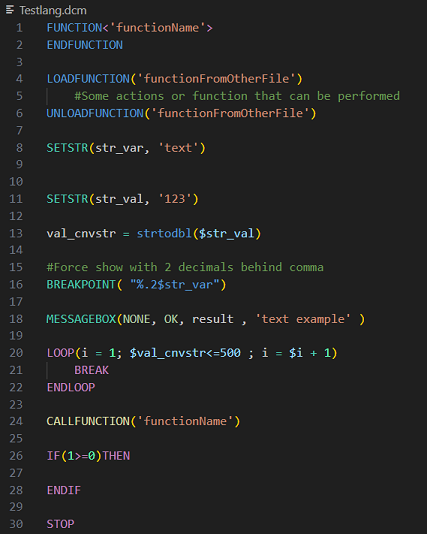

# dcm-lang README

This is the README for extension "dcm-lang". This extention allows you to enjoy highlighted text used in .dcm files (DTPS macro language)

## Features
The extension support autocomplete 'snippets' and syntaxhighlighting for the .dcm file extension used for visualizing dtps macro scripts.

## Requirements

To run dcm files DTPS needs to be installed. The .dcm language files can be created on any pc that runs vscode.

## Known Issues

Not all command arguments are detected (yet) when highlighting code.
Not all commands are created as snippets. 

## Release Notes

Users appreciate release notes as you update your extension.

**Enjoy!**

